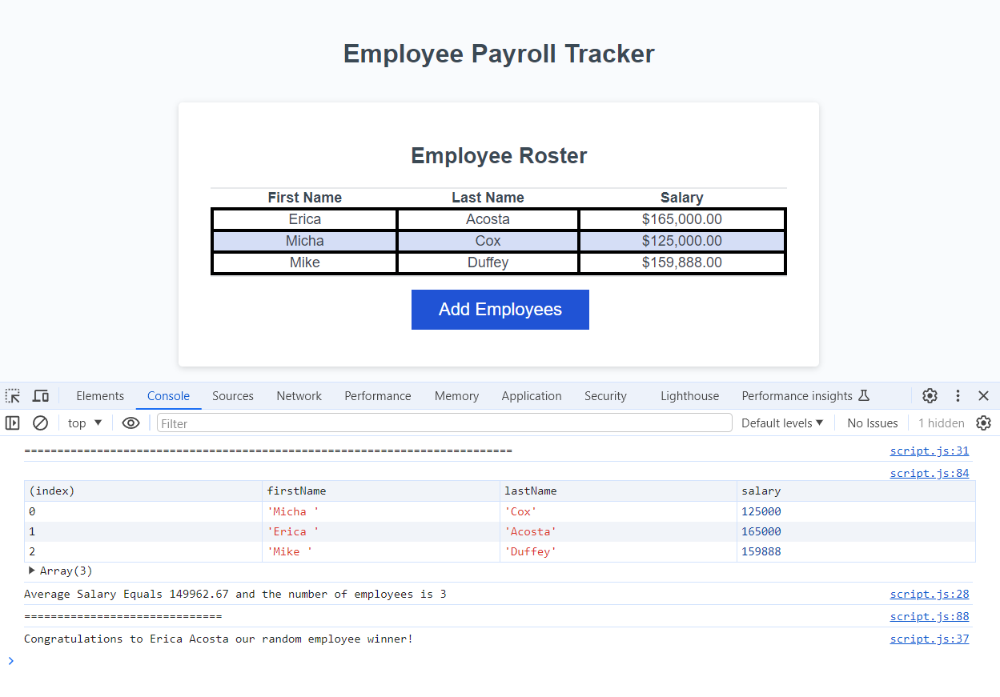

# Employee Payroll Tracking
## **Scope of Work:**
**_My objective was to create an employee payroll tracking interaction. I did that by:_**
* Adding an array of prompts to input the first name, last name, and desired salary of an employee
* Creating a function to give a total for the amount of employess
* Creating a function to give an output of the average salary of all employees
* Having a random lottery type function to select one employee at random for a prize
* Creating a README file
___
[Employee Payroll Tracking][def]

[def]: https://mtduffey36.github.io/employee-tracker/

